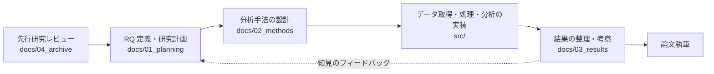

<!--
このREADMEは外部読者（指導教員・ゼミメンバー）向けのリポジトリ入口です。編集時は次の2ルールを守ってください（内容ドリフト防止）:
  1. RQ・研究概要は要約に留め、正本は docs/01_planning/research_guide.md を参照する（ここに詳細を書き足さない）。
  2. 進捗の数値・分析結果は直接書かず、GitHub Project / docs/03_results/ への導線のみとする。
-->

# ベトナム主要都市における地表面温度と都市構造の関係性評価

ベトナムの主要都市を対象に、都市を構成する物理的要素（建物・道路・水域・人口集積など）が**地表面温度（LST: Land Surface Temperature、地表そのものの温度）**の分布に与える影響を定量的に明らかにし、ヒートアイランド現象の発生要因を空間的に把握する修士研究です。あわせて、測量データや詳細な都市データが限られる**途上国大都市というデータ制約下でも、衛星データと公開データによる分析がどこまで有効か**を検証します。

---

## Research Questions

本研究は 3 つの問い（RQ）を軸に進めています（各1行の要約。正本は [research_guide.md](docs/01_planning/research_guide.md)）。

- **RQ1**: Landsat 8（30m 解像度）の LST と都市構造データを組み合わせたとき、どの説明変数が LST に対して支配的か？
- **RQ2**: 都市構造パラメータと LST の関係は、空間集計単位や解析スケールの違いでどう変化するか？
- **RQ3**: 測量データが限られる条件下でも、衛星データと公開データで LST 分布をどの程度説明できるか？

---

## アプローチ

- **LST 算出**: Landsat 8 の熱赤外バンドから **SMW 法（Statistical Mono-Window：単一バンドを用いた統計的な地表面温度推定手法）** で LST を求める（本研究では一貫して摂氏 °C で扱う）。
- **3 つのデータシナリオ**: 利用するデータの範囲を段階的に変えて比較する — **Satellite Only**（衛星由来指標のみ）／**Limited**（衛星＋公開 GIS）／**Full**（衛星＋公開 GIS＋測量 GIS）。
- **関係性の分析**: **RF（Random Forest：多数の決定木を組み合わせる機械学習手法）** で LST を説明し、**SHAP（各説明変数が予測へ与えた寄与を定量化する手法）** で変数の寄与を評価する。空間的な偏りを避けるため **Spatial CV（空間的交差検証：地理的に分離した領域で学習・検証を分ける手法）** を用いる。

---

## 研究ワークフロー

研究フェーズとリポジトリ内フォルダの対応を示します（各フォルダの詳細は下の「リポジトリの歩き方」を参照）。

破線は、得られた結果を踏まえて研究計画（RQ・手法）を見直す反復を表します。

---

## リポジトリの歩き方

| フォルダ | 内容 |
|---|---|
| [`docs/`](docs/README.md) | 研究ドキュメント一式（計画・手法・結果・参考資料）。全体の目次は [docs/README.md](docs/README.md) が正本 |
| `src/` | データ取得・前処理・分析の Python / GEE（Google Earth Engine：Google の衛星データ解析基盤）実装コード |
| `data/` | GIS（地理情報システム）・衛星データ（**Git 管理外**。下の「補足 > 研究データの扱い」を参照） |
| `QGIS/` | QGIS プロジェクト・可視化まわりのファイル |
| `tests/` | `src/` に対する pytest テストコード |

より詳しい研究の背景・目的・手法は [research_guide.md](docs/01_planning/research_guide.md) を参照してください。

---

## 現在の進捗

タスクと進行状況は GitHub Project（Issues）で管理しています。分析結果のまとめは [docs/03_results/](docs/03_results/) を参照してください。

---

## セットアップ

環境構築の手順（Conda 環境・QGIS 等）は [docs/setup.md](docs/setup.md) にまとめています。

---

## 補足

- **研究データの扱い**: `data/` 配下の GIS・衛星データは容量とライセンスの都合で Git 管理対象外とし、Google Drive を用いた 2 層運用で共有しています。
- **AI 協働運用**: 本リポジトリは Claude Code を用いた開発運用を採用しています。運用方針・コーディング規約・タスクワークフローは [CLAUDE.md](CLAUDE.md) を参照してください。
