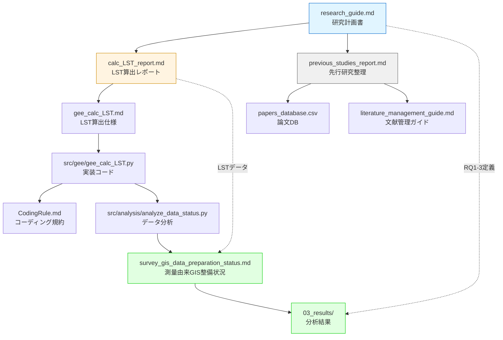

# 📚 研究ドキュメント管理

> **このドキュメントの役割**  
> 本ディレクトリ内のすべてのドキュメントを一元管理する**唯一の真実の情報源（Single Source of Truth）**です。  
> 新しいファイルの追加や構造変更時は、このREADMEのみを更新してください。

本ディレクトリは、修士研究に関するすべてのドキュメントを研究フェーズ別に整理しています。

---

## 🗂️ ディレクトリ構造

```text
docs/
├── README.md                              # 📌 このファイル（全体ガイド）
├── setup.md                               # 🛠️ 環境構築ガイド
├── setup/                                 # 🛠️ 個別ツールのセットアップガイド
│   └── qgis_mcp_setup.md                  # QGIS MCP セットアップガイド
│
├── 01_planning/                           # 📋 研究計画フェーズ
│   ├── available_gis_data.md              # 利用可能な公開GISデータ候補の整理（インデックス）
│   ├── research_guide.md                  # 研究計画書（RQ定義）
│   └── gis_data/                          # カテゴリ別GISデータ詳細（道路・建物・DEM・LULC・人口密度・夜間光・水域・POI密度・不透水面率・公園近接距離、計10ファイル）
│
├── 02_methods/                            # 🔬 研究手法フェーズ
│   ├── analysis_workflow.md               # 分析ワークフロー仕様書（前処理→モデル→評価の全工程）
│   ├── analysis_rq3_satellite_only_guide.md # analysis_rq3_satellite_only.py 初心者向け解説
│   ├── calc_urban_params_guide.md         # urban_paramsパッケージ 設計ガイド
│   ├── gee_calc_satellite_indices.md      # 衛星指標算出仕様書（NDVI/NDBI/NDWI）
│   ├── data_management_guide.md           # データ管理方針（Git + Google Drive 2層運用）
│   ├── calc_LST_report.md                 # LST算出レポート
│   ├── gee_calc_LST.md                    # LST算出仕様書
│   ├── skill_operation_rules.md           # スキル運用ルール
│   ├── qgis_mcp_usage_guide.md            # QGIS MCP活用ガイド（ユースケース別操作例）
│   ├── qgis_operation_guidelines.md       # QGIS運用ガイドライン（命名規則・CRS方針・注意事項）
│   └── CodingRule.md                      # Pythonコーディング規約
│
├── 03_results/                            # 📊 研究結果フェーズ
│   ├── GIS_IDEAS_abstract.md            # GIS-IDEAS学会用アブストラクト下書き
│   ├── survey_gis_data_preparation_status.md # 測量由来GISデータ整備状況レポート
│   ├── fig2_satellite_only_workflow.mmd   # RQ3図表用Mermaid図
│   └── satellite_only_analysis_results.md # Satellite Only 分析結果
│
└── 04_archive/                            # 📦 アーカイブ
    ├── README.md                          # 文献管理システムガイド
    ├── literature_management_guide.md     # 文献管理・AI活用ガイド
    ├── previous_studies_report.md         # 先行研究整理（S1-S8）
    ├── 01_metadata/
    │   └── papers_database.csv            # 論文メタデータ（CSV）
    ├── 02_structured_summaries/
    │   ├── S1_Ermida_2020.md              # SMW法の構造化要約
    │   └── S2-S8_*.md                     # 既存構造化要約
    └── templates/
        ├── chatgpt_instruction_paper_analysis.md # ChatGPT論文分析指示書
        └── structured_summary_template.md # 論文要約テンプレート
```

---

## 📊 全ドキュメントカタログ

### 🛠️ ルート

| ファイル名 | 概要 | 主要な内容 | 更新契機 |
|-----------|------|-----------|--------|
| [README.md](README.md) | docs全体の索引 | ドキュメント構造、管理ルール、関連リンク | docs配下の重要ファイル追加・改名時 |
| [setup.md](setup.md) | 環境構築ガイド | `environment.yml` を正本としたセットアップ手順、依存確認、GitHub CLI セットアップ、実行例 | 依存関係・実行手順・ツール要件の変更時 |

### 🛠️ setup - 個別ツールのセットアップガイド

| ファイル名 | 概要 | 主要な内容 | 関連ファイル |
|-----------|------|-----------|------------|
| [qgis_mcp_setup.md](setup/qgis_mcp_setup.md) | QGIS MCP セットアップガイド | nkarasiak/qgis-mcp の導入手順、接続設定、トラブルシューティング | `.mcp.json` |

### 📋 01_planning - 研究計画

| ファイル名 | 概要 | 主要な内容 | 関連RQ |
|-----------|------|-----------|--------|
| [available_gis_data.md](01_planning/available_gis_data.md) | 公開GISデータ候補の整理（インデックス） | 評価観点、採用データ一覧、結論の要点、カテゴリ別ドキュメントへのリンク | 全RQ |
| [gis_data_roads.md](01_planning/gis_data/gis_data_roads.md) | 道路データの調査・評価 | OSM道路データの採用根拠、Hanoi ROI取得結果、highway分布、注意点 | RQ1, RQ2 |
| [gis_data_buildings.md](01_planning/gis_data/gis_data_buildings.md) | 建物データの調査・評価 | GBA採用根拠、候補比較表、GBA詳細仕様、Limitedシナリオ方針 | RQ1, RQ2, RQ3 |
| [gis_data_dem.md](01_planning/gis_data/gis_data_dem.md) | DEM候補の調査・選定ガイド | DSM/DTM特性、センサー種別、BSHorizon比較結果、Limitedシナリオ採用判断 | RQ1, RQ3 |
| [research_guide.md](01_planning/research_guide.md) | 研究計画書 | 研究題目、背景、RQ1-3、手法概要、期待される成果 | 全RQ |

### 🔬 02_methods - 研究手法

| ファイル名 | 概要 | 主要な内容 | 実装ファイル |
|-----------|------|-----------|------------|
| [analysis_workflow.md](02_methods/analysis_workflow.md) | 分析ワークフロー仕様書 | 前処理→都市構造パラメータ算出→モデル構築→評価の全工程定義、RQ別分析設計 | `src/` 全スクリプト |
| [analysis_rq3_satellite_only_guide.md](02_methods/analysis_rq3_satellite_only_guide.md) | RQ3衛星のみ分析コード解説 | 初心者向けに処理フロー、評価指標、Spatial CV、SHAPの読み方を整理 | `src/analysis/analysis_rq3_satellite_only.py` |
| [calc_urban_params_guide.md](02_methods/calc_urban_params_guide.md) | `urban_params` パッケージ 設計ガイド | 解析範囲設計、マルチスケールUTMグリッド化、3シナリオ・GIS/衛星指標統合、品質管理列の仕様 | `src/analysis/urban_params/` |
| [gee_calc_satellite_indices.md](02_methods/gee_calc_satellite_indices.md) | 衛星指標算出仕様書 | NDVI/NDBI/NDWI算出式、QAマスク、スケーリング、統計出力の仕様と根拠 | `src/gee/gee_calc_satellite_indices.py` |
| [data_management_guide.md](02_methods/data_management_guide.md) | データ管理ガイド | 2層運用（Git + Google Drive）、.gitignore方針、再現性確保手順 | `data/`, `.gitignore` |
| [calc_LST_report.md](02_methods/calc_LST_report.md) | LST算出レポート | SMW法の選定理由、処理結果、品質評価 | `src/gee/gee_calc_LST.py` |
| [gee_calc_LST.md](02_methods/gee_calc_LST.md) | LST算出仕様書 | gee_calc_LST.pyの詳細仕様、入出力定義 | `src/gee/gee_calc_LST.py` |
| [skill_operation_rules.md](02_methods/skill_operation_rules.md) | スキル運用ルール | 環境別の作成・利用ルール、プロジェクト固有ルール | `.claude/skills/` |
| [qgis_mcp_usage_guide.md](02_methods/qgis_mcp_usage_guide.md) | QGIS MCP活用ガイド | データ確認・レイヤー操作・スタイル適用・Map Theme切り替え・Processing実行のユースケース別操作例 | `qgis/` |
| [qgis_operation_guidelines.md](02_methods/qgis_operation_guidelines.md) | QGIS運用ガイドライン | レイヤー命名規則、CRS統一方針、保存先ルール、ラスター疑似カラースタイル作成時の注意（classificationMin/Max）、大規模レイヤーのクラッシュ対策 | `qgis/` |
| [CodingRule.md](02_methods/CodingRule.md) | コーディング規約 | PEP 8準拠（ruffで自動チェック）、型ヒント、docstring規則、命名規則、再現性確保 | 全Pythonスクリプト |

### 📊 03_results - 研究結果

| ファイル名 | 概要 | 主要な内容 | 自動生成元 |
|-----------|------|-----------|-----------|
| [GIS_IDEAS_abstract.md](03_results/GIS_IDEAS_abstract.md) | GIS-IDEAS学会用アブストラクト下書き | RQ3 Satellite Only の本文案、図表案、表現上の注意点 | `docs/03_results/`, `data/csv/analysis/`, `src/analysis/` |
| [survey_gis_data_preparation_status.md](03_results/survey_gis_data_preparation_status.md) | 測量由来GISデータ整備状況レポート | 測量由来GISの整備、内容確認、Full シナリオ接続条件 | `src/analysis/analyze_data_status.py`, `src/preprocessing/*` |
| [fig2_satellite_only_workflow.mmd](03_results/fig2_satellite_only_workflow.mmd) | RQ3図表用Mermaid図 | Satellite Only 分析フローを図2向けに整理した構成図 | `docs/03_results/`, `src/analysis/` |
| [satellite_only_analysis_results.md](03_results/satellite_only_analysis_results.md) | Satellite Only 分析結果 | 3観測日のベースライン、Spatial CV、SHAP、今後の比較方針 | `src/analysis/build_satellite_only_dataset.py`, `src/analysis/analysis_rq3_satellite_only.py` |

**今後追加予定**:

- RQ1分析結果: 変数重要度ランキング、モデル性能
- RQ2分析結果: 空間スケール別の比較
- 図表集: 論文用図表の一覧

### 📦 04_archive - アーカイブ・先行研究

| ファイル名 | 概要 | 主要な内容 | 活用場面 |
|-----------|------|-----------|---------|
| [README.md](04_archive/README.md) | 文献管理システムガイド | 文献データベースの構造、AI活用方法 | 文献追加時 |
| [literature_management_guide.md](04_archive/literature_management_guide.md) | 文献管理詳細ガイド | PDFのMarkdown変換戦略、ベストプラクティス | 論文要約作成時 |
| [previous_studies_report.md](04_archive/previous_studies_report.md) | 先行研究整理 | S1-S8の事実整理、手法・データ・結論 | 論文執筆、手法比較 |
| [01_metadata/papers_database.csv](04_archive/01_metadata/papers_database.csv) | 論文メタデータ | 8論文のCSVデータベース（著者、年、RQ関連度） | AI検索、フィルタリング |
| [templates/chatgpt_instruction_paper_analysis.md](04_archive/templates/chatgpt_instruction_paper_analysis.md) | ChatGPT用論文分析指示書 | PDFや書誌情報から構造化要約を作る標準プロンプト | 論文要約作成前 |
| [templates/structured_summary_template.md](04_archive/templates/structured_summary_template.md) | 論文要約テンプレート | 新規論文追加時の標準フォーマット | 論文要約作成時 |

**先行研究一覧（S1-S8）**:

- **S1**: Ermida et al. (2020) - SMW法 [本研究採用手法]
- **S2**: Le Ngoc Hanh (2025) - ベトナム・ダナン [地域参考]
- **S3**: Onačillová (2022) - 高解像度LST
- **S4**: Sun et al. (2019) - 機械学習による都市構造評価 [RQ1参考]
- **S5**: Osborne (2019) - 景観構成・配置
- **S6**: Garzón (2021) - 熱帯都市SUHI
- **S7**: Derdouri et al. (2021) - LULC変化とSUHI研究レビュー
- **S8**: Lin et al. (2024) - UFZ別2D/3D都市形態とUHI要因分析

**構造化要約（現存ファイル）**:

- [S1_Ermida_2020.md](04_archive/02_structured_summaries/S1_Ermida_2020.md)
- [S2_LeNgocHanh_2025.md](04_archive/02_structured_summaries/S2_LeNgocHanh_2025.md)
- [S3_Onacillova_2022.md](04_archive/02_structured_summaries/S3_Onacillova_2022.md)
- [S4_Sun_2019.md](04_archive/02_structured_summaries/S4_Sun_2019.md)
- [S5_Osborne_2019.md](04_archive/02_structured_summaries/S5_Osborne_2019.md)
- [S6_Garzon_2021.md](04_archive/02_structured_summaries/S6_Garzon_2021.md)
- [S7_Derdouri_2021.md](04_archive/02_structured_summaries/S7_Derdouri_2021.md)
- [S8_Lin_2024.md](04_archive/02_structured_summaries/S8_Lin_2024.md)

---

## 🔄 ドキュメント関係図


```mermaid
graph TB
    A[research_guide.md<br/>研究計画書] --> B[calc_LST_report.md<br/>LST算出レポート]
    A --> C[previous_studies_report.md<br/>先行研究整理]
    
    B --> D[gee_calc_LST.md<br/>LST算出仕様]
    D --> E[src/gee/gee_calc_LST.py<br/>実装コード]
    
    C --> F[papers_database.csv<br/>論文DB]
    C --> G[literature_management_guide.md<br/>文献管理ガイド]
    
    E --> H[CodingRule.md<br/>コーディング規約]
    E --> J[src/analysis/analyze_data_status.py<br/>データ分析]
    
    J --> K[survey_gis_data_preparation_status.md<br/>測量由来GIS整備状況]
    
    A -.RQ1-3定義.-> I[03_results/<br/>分析結果]
    B -.LSTデータ.-> K
    K --> I
    
    style A fill:#e1f5ff,stroke:#0066cc
    style B fill:#fff4e1,stroke:#cc8800
    style C fill:#f0f0f0,stroke:#666
    style I fill:#e1ffe1,stroke:#00cc00
    style K fill:#e1ffe1,stroke:#00cc00
```

**凡例**:

- 🔵 青: 研究計画
- 🟡 黄: 研究手法
- ⚪ 灰: アーカイブ
- 🟢 緑: 研究結果（今後）

---

## 📋 [01_planning](01_planning/) - 研究計画フェーズ

### 🎯 目的

研究の方向性を定め、RQ（Research Questions）を明確化する

### 📄 ドキュメント詳細

#### [available_gis_data.md](01_planning/available_gis_data.md)

**公開GISデータ候補の整理（インデックス）** - 採用データの一覧と評価観点を集約し、カテゴリ別詳細ドキュメントへのリンクを提供する

**主要セクション**:

- 評価観点（都市構造指標適格性、カバレッジ、データ時期、解像度、ライセンス）
- 結論の要点（各カテゴリの採用判断サマリ）
- 採用データ一覧（OSM、GBA、FABDEM）
- カテゴリ別詳細ドキュメントへのリンク

**関連ドキュメント**:

- 研究計画 → [research_guide.md](01_planning/research_guide.md)
- 手法仕様 → [analysis_workflow.md](02_methods/analysis_workflow.md)

#### [gis_data/](01_planning/gis_data/)

**カテゴリ別GISデータ詳細** - 各データカテゴリの調査結果・データ仕様・取得結果・注意点を格納するサブフォルダ

各ファイルの一覧と詳細は [available_gis_data.md](01_planning/available_gis_data.md) の Section 4（カテゴリ別詳細ドキュメント）を参照。

#### [research_guide.md](01_planning/research_guide.md)

**研究計画書** - 本研究の全体像を定義

**主要セクション**:

- 研究題目: ベトナム主要都市における地表面温度と都市構造の関係性評価
- 研究背景: 途上国大都市のデータ制約、ヒートアイランド現象
- **Research Questions**:
  - **RQ1**: どの説明変数がLSTに支配的か？
  - **RQ2**: 空間集計単位の違いによる影響は？
  - **RQ3**: データ制約下での説明可能性は？
- 研究手法: SMW法、衛星データ、公開データ、機械学習
- 期待される成果: データ制約下での分析手法の有効性検証

**関連ドキュメント**:

- 手法詳細 → [calc_LST_report.md](02_methods/calc_LST_report.md)
- 先行研究 → [previous_studies_report.md](04_archive/previous_studies_report.md)

### 📝 今後追加予定

- `literature_review.md`: 詳細な文献レビュー
- `timeline.md`: 研究スケジュール

---

## 🔬 [02_methods](02_methods/) - 研究手法フェーズ

### 🎯 目的

研究で使用する具体的な手法やツールを詳細に記録し、再現性を確保する

### 📄 ドキュメント詳細

#### [calc_LST_report.md](02_methods/calc_LST_report.md)

**Landsat 8 LST算出レポート** - SMW法による地表面温度算出の実施報告

**主要セクション**:

- LST算出手法の選定理由（SMW法 vs 他手法）
- 処理結果: 2015-2024年のLSTデータ
- 品質評価: RMSE、欠損率、雲被覆率
- 次のステップ: 都市構造パラメータとの統合分析

**実装コード**: [src/gee/gee_calc_LST.py](../src/gee/gee_calc_LST.py)

**関連ドキュメント**:

- 手法の理論的背景 → [previous_studies_report.md S1](04_archive/previous_studies_report.md)
- 実装仕様 → [gee_calc_LST.md](02_methods/gee_calc_LST.md)

#### [gee_calc_LST.md](02_methods/gee_calc_LST.md)

**gee_calc_LST.pyの仕様書** - LST算出スクリプトの詳細仕様

**主要セクション**:

- 入力データ: `data/input/gee_calc_LST_info.csv`
- 出力データ: `data/satellite/lst/*.tif`、`data/output/gee_calc_LST_results.csv`
- 処理フロー: GEE認証 → ROI読込 → LST算出 → 品質評価
- 関数仕様: `lst_smw.apply_smw_lst()`
- エラーハンドリング: タイムアウト、雲被覆対応

**実装コード**: [src/gee/gee_calc_LST.py](../src/gee/gee_calc_LST.py)

**関連ドキュメント**:

- コーディング規約 → [CodingRule.md](02_methods/CodingRule.md)

#### [skill_operation_rules.md](02_methods/skill_operation_rules.md)

**スキル運用ルール** - `.claude/skills/` 配下のカスタムスキルの作成・変更・運用ルール

**主要ルール**:

- 環境ルール: スキルの作成・変更は Claude Desktop（Skill Creator 使用）、VS Code は利用のみ
- プロジェクト固有ルール: 日本語コメント基本、ファイルパスはスラッシュ統一

**適用範囲**: `.claude/skills/` 配下のすべてのスキル

**関連ドキュメント**:

- コーディング規約 → [CodingRule.md](02_methods/CodingRule.md)
- AI指示書 → [CLAUDE.md](../CLAUDE.md)

#### [CodingRule.md](02_methods/CodingRule.md)

**Pythonコーディング規約** - プロジェクト全体で遵守すべき規約

**主要ルール**:

- PEP 8準拠（スペース4つ、タブ禁止、`ruff check`/`ruff format`で自動チェック）
- 型ヒントを関数の引数・戻り値に付与
- 日本語docstring必須（初心者にも理解できる説明）
- 命名規則: スネークケース（変数・関数）、キャメルケース（クラス）
- 1関数1責務
- 再現性: 相対パス、乱数シード設定

**適用範囲**: `src/`配下のすべてのPythonスクリプト

**関連ドキュメント**:

- AI指示書 → [CLAUDE.md](../CLAUDE.md)

### 📝 今後追加予定

- `urban_parameters.md`: 都市構造パラメータの定義と算出方法
- `statistical_methods.md`: 統計解析手法の詳細
- `ml_models.md`: 機械学習モデルの選定と実装

---

## 📊 [03_results](03_results/) - 研究結果フェーズ

### 🎯 目的

分析結果を体系的に整理し、論文執筆の基盤を構築する

### � ドキュメント詳細

#### [GIS_IDEAS_abstract.md](03_results/GIS_IDEAS_abstract.md)

**GIS-IDEAS学会用アブストラクト下書き** - RQ3 の Satellite Only 初期結果に基づく本文案と図表案

**主要セクション**:

- Introduction / Methodology / Results / Conclusion の文案
- 掲載候補の図表セット
- 断定を避けるべき事項とタイトル案

**関連ドキュメント**:

- 初期結果 → [satellite_only_analysis_results.md](03_results/satellite_only_analysis_results.md)
- 研究計画 → [research_guide.md](01_planning/research_guide.md)

#### [survey_gis_data_preparation_status.md](03_results/survey_gis_data_preparation_status.md)

**測量由来GISデータ整備状況レポート** - 測量由来 GIS の整備、内容確認、Full シナリオ接続条件の整理

**主要セクション**:

- 測量由来 GIS データ整備の全体概況
- 7種類の GPKG（CS/DC/DH/GT/RG/TH/TV）の処理結果
- レイヤ意味の確認結果と想定用途
- Full シナリオへ接続するための残課題

**自動生成元**: [src/analysis/analyze_data_status.py](../src/analysis/analyze_data_status.py)（GIS/LSTデータを自動分析）

**活用場面**:

- 測量由来 GIS の入力仕様確認
- Full シナリオの前提整理
- 都市構造パラメータ設計時の根拠確認

**関連ドキュメント**:

- 研究計画 → [research_guide.md](01_planning/research_guide.md)（RQ1-3の定義）
- 手法フロー → [analysis_workflow.md](02_methods/analysis_workflow.md)
- パラメータ設計 → [calc_urban_params_guide.md](02_methods/calc_urban_params_guide.md)

#### [satellite_only_analysis_results.md](03_results/satellite_only_analysis_results.md)

**Satellite Only 分析結果** - RQ3 の 3 観測日ベースライン整理

**主要セクション**:

- 2023-07-07、2023-07-23、2024-11-30 の分析条件
- MLR / Random Forest の複数日性能比較
- Spatial CV による過大評価確認
- SHAP による変数重要度と寄与方向の解釈
- Limited / Full 比較に向けた次段階整理

**自動生成元**: `src/analysis/build_satellite_only_dataset.py`, `src/analysis/analysis_rq3_satellite_only.py`

#### [fig2_satellite_only_workflow.mmd](03_results/fig2_satellite_only_workflow.mmd)

**RQ3図表用Mermaid図** - Satellite Only 分析フローを論文図表向けに整理した図

**主要セクション**:

- データ準備からモデル評価までの処理順
- Satellite Only 条件で使う説明変数群
- 図表化を前提にした簡潔なノード構成

**関連ドキュメント**:

- 分析結果 → [satellite_only_analysis_results.md](03_results/satellite_only_analysis_results.md)
- 解析ガイド → [analysis_rq3_satellite_only_guide.md](02_methods/analysis_rq3_satellite_only_guide.md)

### �📝 今後追加予定のドキュメント

#### RQ別の分析結果

- `rq1_variable_importance.md`: RQ1結果 - 説明変数の重要度ランキング
- `rq2_spatial_scale.md`: RQ2結果 - 空間集計単位ごとの比較分析

#### 統合結果

- `analysis_summary.md`: 全分析結果の統合まとめ
- `figures_catalog.md`: 論文用図表の一覧と説明
- `discussion_draft.md`: 考察の下書き

#### 補足資料

- `model_performance.md`: 各種モデルの性能比較
- `sensitivity_analysis.md`: 感度分析結果

### 🔗 関連ドキュメント

- 研究計画 → [research_guide.md](01_planning/research_guide.md)（RQ定義）
- データソース → [calc_LST_report.md](02_methods/calc_LST_report.md)（LSTデータ）
- 先行研究比較 → [previous_studies_report.md](04_archive/previous_studies_report.md)

---

## 📦 [04_archive](04_archive/) - アーカイブ・先行研究

### 🎯 目的

参考資料や先行研究を整理し、AI支援による文献活用を可能にする

### 📄 ドキュメント詳細

#### [README.md](04_archive/README.md)

**文献管理システムガイド** - 04_archiveフォルダの構造と使い方

**主要内容**:

- 3層情報管理システム（CSV → Markdown → PDF）
- AIとの対話例
- 文献追加手順

**対象ユーザー**: 研究者本人、AI支援システム

#### [literature_management_guide.md](04_archive/literature_management_guide.md)

**文献管理・AI活用ガイド** - PDFをAIが活用するための戦略書（314行）

**主要セクション**:

- 問題: AIはPDFを直接読めない
- 解決策: Markdown構造化要約の作成
- 3層データベースコンセプト（metadata → summaries → findings）
- 論文要約作成ガイド（30-60分/論文）
- AI最適化のベストプラクティス

**関連ドキュメント**:

- テンプレート → [templates/structured_summary_template.md](04_archive/templates/structured_summary_template.md)

#### [previous_studies_report.md](04_archive/previous_studies_report.md)

**先行研究整理（マスタードキュメント）** - S1-S8の事実ベース整理

**含まれる研究**:

- **S1**: Ermida et al. (2020) - SMW法 [本研究採用]
- **S2**: Le Ngoc Hanh (2025) - ダナン都市化とLST [ベトナム事例]
- **S3**: Onačillová (2022) - 高解像度LST
- **S4**: Sun et al. (2019) - 機械学習による都市構造評価 [RQ1参考]
- **S5**: Osborne (2019) - 景観構成・配置 [RQ2参考]
- **S6**: Garzón (2021) - 熱帯都市SUHI [途上国事例]
- **S7**: Derdouri et al. (2021) - LULC変化とSUHI研究レビュー
- **S8**: Lin et al. (2024) - UFZ別2D/3D都市形態とUHI要因分析

**活用場面**: 論文執筆、手法比較、関連研究の参照

**関連ドキュメント**:

- 詳細メタデータ → [01_metadata/papers_database.csv](04_archive/01_metadata/papers_database.csv)

#### [01_metadata/papers_database.csv](04_archive/01_metadata/papers_database.csv)

**論文メタデータベース（CSV）** - AI検索・フィルタリング用

**列構成**:

- ID, 著者, 年, タイトル, 掲載誌, 主目的, データ種別
- 主要手法, 対象地域, DOI_URL, PDF有無
- 重要度（A/B/C）, RQ1-3関連度（◎○△）
- キーワード, メモ

**活用方法**:

```python
import pandas as pd
df = pd.read_csv('papers_database.csv')
# RQ1に関連する論文を抽出
rq1_papers = df[df['RQ1関連'].str.contains('◎|○')]
```

#### [templates/structured_summary_template.md](04_archive/templates/structured_summary_template.md)

**論文要約テンプレート** - 新規論文追加時の標準フォーマット

**セクション構成**:

1. 基本情報（著者、年、DOI）
2. 研究目的
3. 使用データ
4. 都市構造パラメータの定義
5. 分析手法
6. 主要な結果
7. 本研究との関連性（RQ1-3）
8. 重要な引用・図表

**使用タイミング**: 新しい論文をデータベースに追加する際

### 📁 サブディレクトリ

```text
04_archive/
├── 01_metadata/              # 論文メタデータ
│   └── papers_database.csv
├── 02_structured_summaries/  # 構造化要約（S1-S6登録済み）
│   └── S1_Ermida_2020.md 等
├── 03_key_findings/          # テーマ別知見（今後追加）
│   ├── urban_parameters_catalog.md
│   └── lst_methods_comparison.md
├── 04_pdfs/                  # PDF原本（移動予定）
└── templates/                # テンプレート
    ├── chatgpt_instruction_paper_analysis.md
    └── structured_summary_template.md
```

### 🔗 関連ドキュメント

- 研究計画との対応 → [research_guide.md](01_planning/research_guide.md)
- 採用手法の詳細 → [calc_LST_report.md](02_methods/calc_LST_report.md)

---

## 🔄 ドキュメント管理のルール

### ✅ 新しいドキュメントを追加する場合

1. **適切なフェーズを選択**:
   - 📋 `01_planning/`: 研究の方向性・RQ定義
   - 🔬 `02_methods/`: 手法・ツールの詳細仕様
   - 📊 `03_results/`: 分析結果・図表
   - 📦 `04_archive/`: 参考資料・先行研究

2. **このREADME.mdを更新**:
   - 該当フェーズの「ドキュメント詳細」セクションに追加
   - 「全ドキュメントカタログ」テーブルに行を追加
   - 必要に応じて「ドキュメント関係図」を更新

3. **相互参照を設定**:
   - 新規ドキュメントの冒頭に**関連ドキュメント**セクションを追加
   - 既存ドキュメントから新規ドキュメントへのリンクを追加

4. **メタ情報を記載**:

   ```markdown
   # ドキュメントタイトル
   
   **最終更新**: 2026-02-26  
   **関連ドキュメント**: [research_guide.md], [CodingRule.md]  
   **前提知識**: RQ1-RQ3の理解
   ```

### ✅ ドキュメントを移動・削除する場合

1. **リンク切れを確認**:

   ```powershell
   # 影響範囲を確認
   grep -r "旧ファイル名" docs/
   ```

2. **影響を受けるドキュメントを更新**:
   - 相互参照しているドキュメントのリンクを修正
   - このREADME.mdのパスを更新

3. **Git履歴を保持**:

   ```bash
   git mv 旧パス 新パス
   ```

### ✅ ファイル命名規則

- **小文字とアンダースコア**: `analysis_results.md`（推奨）
- **内容が分かる名前**: ❌ `doc1.md` → ✅ `rq1_variable_importance.md`
- **日付を含める場合**: `20260226_meeting_notes.md`（YYYYMMDD形式）
- **バージョン管理**: `analysis_v1.md`より Git を使用

### ❌ 禁止事項

- **サブフォルダのREADME.md作成**: このdocs/README.mdに集約
  - 例外: `04_archive/README.md`のみ（文献管理が複雑なため）
- **重複記述**: 同じ内容を複数ファイルに記載しない（Single Source of Truth原則）
- **絶対パスの使用**: 相対パスを使用し移植性を確保

---

## 💡 活用のヒント

### 🔬 先行研究調査：ChatGPT → GitHub Copilot 連携ワークフロー

> **最も効率的な方法**: ChatGPTで論文分析 → GitHub Copilotでプロジェクト統合

#### フェーズ1: 論文検索（ChatGPT + ScholarGPT）

```text
ChatGPTに質問：
「Land Surface Temperature and urban structure in Southeast Asian cities
 で2020年以降の主要論文を教えて。各論文のDOI、引用数、主要な手法も教えて」

→ 論文リスト（10-15本）を取得
```

#### フェーズ2: 論文分析（ChatGPT）

```text
ChatGPTに依頼：
「docs/04_archive/templates/chatgpt_instruction_paper_analysis.md の
 指示に従って、以下の論文を分析してください」
 
【論文情報】
- タイトル: [論文タイトル]
- 著者: [著者名]
- DOI: [DOI]
（またはPDFを添付）

→ 構造化要約が自動生成される（5-10分）
```

#### フェーズ3: プロジェクト統合（GitHub Copilot）

```text
VS Code（GitHub Copilot）に依頼：
「ChatGPTが生成したS9_Zhang_2023.md を保存しました。
 この内容を papers_database.csv に追加し、
 previous_studies_report.md を更新してください」

→ データベースが自動更新される（1-2分）
```

**所要時間**: 論文1本あたり **合計10-15分** 🚀

**詳細ガイド**: [04_archive/README.md](04_archive/README.md)（ツール使い分けセクション）

---

### 🤖 AIに質問する場合

**効果的な質問例**:

```text
「research_guide.mdを参照して、RQ1に関連する分析手法を提案してください」

「previous_studies_report.mdから、都市構造パラメータの定義を抽出し、
 表形式でまとめてください」

「calc_LST_report.mdに基づいて、SMW法の処理フローを
 Mermaid図で作成してください」

「papers_database.csvから重要度Aの論文のみをフィルタリングし、
 RQ1との関連度が高い順に並べてください」
```

**NGな質問例**:

```text
❌ 「先行研究を教えて」（曖昧）
✅ 「previous_studies_report.mdのS4（Sun et al. 2019）で使用された
    都市構造パラメータを箇条書きで教えて」

❌ 「LSTの計算方法は？」（文脈不明）
✅ 「gee_calc_LST.mdを参照して、SMW法の入力パラメータと
    出力フォーマットを説明して」
```

### 📖 ドキュメント間の関連を確認

**研究の流れに沿って参照**:

```text
1. 研究計画  → research_guide.md（RQ定義）
2. 先行研究  → previous_studies_report.md（手法調査）
3. 手法選定  → calc_LST_report.md（LST算出）
4. 実装仕様  → gee_calc_LST.md
5. コード規約 → CodingRule.md
6. 実装      → src/gee/gee_calc_LST.py
7. 結果整理  → 03_results/（今後）
```

**ドキュメント関係図を活用**:

- Mermaid図で視覚的に依存関係を把握
- 矢印の方向 = 参照の流れ

### 🔍 検索のコツ

**VS Codeでの検索**:

```text
Ctrl+Shift+F で全文検索
- "RQ1" → Research Question 1 関連の記述を検索
- "SMW" → SMW法に関する記述を検索
- "都市構造パラメータ" → パラメータ定義を検索
```

**CSVデータの活用**:

```python
# 特定のキーワードで論文を検索
df = pd.read_csv('docs/04_archive/01_metadata/papers_database.csv')
ml_papers = df[df['キーワード'].str.contains('機械学習|ランダムフォレスト')]
```

---

## 🔗 関連ディレクトリ

### プロジェクト全体の構成

```text
MasterResearch/
├── .claude/                     # Claude Code設定
│   └── skills/                  # カスタムskill（check-docs-consistency等）
│
├── .github/                    # AI環境設定・タスク管理
│   ├── copilot-instructions.md # Copilot自動読込（CLAUDE.mdに移譲）
│   ├── task-workflow.md        # タスク管理ワークフロー定義
│   ├── parallel-workflow.md    # 並列タスク実行ワークフロー
│   ├── ISSUE_TEMPLATE/         # Issue テンプレート
│   └── prompts/                # タスク関連ファイル
│       ├── active/             # 計画書（{Issue番号}_{task_name}.plan.md）
│       ├── completed/          # 旧運用アーカイブ（新規追加なし）
│       └── templates/          # intake テンプレート（オプション）
│
├── docs/                       # 📌 このディレクトリ
│   └── README.md               # 📌 このファイル
│
├── src/                        # Pythonスクリプト
│   ├── gee/gee_calc_LST.py     # LST算出メイン
│   ├── module/lst_smw.py       # SMW法モジュール
│   ├── analysis/               # 分析スクリプト
│   │   ├── urban_params/       # 都市構造パラメータ算出パッケージ（python -m src.analysis.urban_params）
│   │   └── *.py                # その他分析スクリプト
│   └── preprocessing/*.py      # GIS前処理スクリプト
│
├── tests/                      # テスト（pytest）
│   └── analysis/urban_params/  # urban_paramsパッケージのユニットテスト
│
├── data/                       # データ
│   ├── satellite/              # 衛星由来データ
│   │   ├── lst/                # LST GeoTIFF（年別）
│   │   └── indices/            # 衛星指標（NDVI/NDBI 等）
│   ├── gis/                    # GIS空間データ
│   │   ├── boundaries/         # ROI・行政界
│   │   ├── dem/                # 標高データ（ソース別）
│   │   ├── buildings/          # 建物データ
│   │   ├── roads/              # 道路データ
│   │   ├── survey/             # 測量マージデータ
│   │   ├── maps/               # 地図タイル・結合地図
│   │   └── raw/                # 未加工ソースデータ
│   ├── input/                  # 軽量な設定ファイル（CSV, txt）
│   │   ├── gee_calc_LST_info.csv
│   │   └── map_info.csv
│   ├── output/                 # 分析結果（CSV, JSON, ログ）
│   │   └── gee_calc_LST_results.csv
│   └── csv/analysis/           # 分析用CSV
│
├── qgis/                        # QGISワークスペース（詳細: qgis_operation_guidelines.md）
│   ├── projects/                # 都市単位のQGISプロジェクト（.qgz、Git管理外）
│   ├── styles/                  # 再利用スタイル（.qml、Git追跡）
│   └── templates/               # 印刷レイアウトテンプレート（.qpt、Git追跡）
│
└── 整備データ/                  # ベトナム測量データ
    └── merge/*.gpkg            # 統合GeoPackage
```

### 各ディレクトリの関係

| ディレクトリ | 役割 | docs/との関係 |
|------------|------|--------------|
| `.github/` | AI支援環境 | copilot-instructions.mdがdocs/を参照 |
| `src/` | 実装コード | docs/02_methods/の仕様に基づく |
| `data/` | データ | docs/02_methods/で入出力を定義 |
| `整備データ/` | 元データ | docs/で使用方法を説明（今後） |

---

## 📋 チェックリスト

### 新規ドキュメント追加時

- [ ] 適切なフェーズフォルダに配置
- [ ] docs/README.mdを更新（このファイル）
- [ ] 冒頭にメタ情報を記載（最終更新日、関連ドキュメント）
- [ ] 相互参照リンクを設定
- [ ] 必要に応じてドキュメント関係図を更新

### ドキュメント更新時

- [ ] 最終更新日を更新
- [ ] 重要な変更は変更履歴に記録
- [ ] 影響を受ける関連ドキュメントを確認
- [ ] リンク切れがないか確認

### 定期メンテナンス

- [ ] 月1回: 全ドキュメントの整合性チェック（`/check-docs-consistency` skillを使用）
- [ ] 研究フェーズ移行時: ドキュメント構成の見直し
- [ ] 論文投稿前: 全ドキュメントの整合性確認

---

## 📝 変更履歴

| 日付 | 変更内容 | 担当 |
|------|---------|------|
| 2026-07-05 | 土地利用・人口密度・夜間光・水域（近接距離・面積率）・POI密度・不透水面率・公園近接距離の8カテゴリについて、オープンソースGISデータセット候補を調査。`gis_data/`配下に7ファイルを新規追加し、`available_gis_data.md` Section 4にリンクを追加 | AI支援 |
| 2026-07-01 | `qgis_mcp_usage_guide.md`・`qgis_operation_guidelines.md` を `02_methods/` に新規追加。`qgis/`（projects/styles/templates）ワークスペースの整備に伴うドキュメント整備（#41） | AI支援 |
| 2026-06-30 | `docs/setup/` を新設し `qgis_mcp_setup.md` を `02_methods/` から移動。`data_catalog.csv` 廃止に伴い `data_management_guide.md` を改訂（Google Drive 2層運用の役割明確化、MCP経由アクセスへの移行）（#44） | AI支援 |
| 2026-06-24 | `available_gis_data.md` をカテゴリ別ファイルに分割。`gis_data/` サブフォルダを新設し、`gis_data_roads.md`・`gis_data_buildings.md` を新規作成。`dem_selection_guide.md` を `gis_data/gis_data_dem.md` に移動・リネーム（#29） | AI支援 |
| 2026-06-13 | `check-docs-consistency` skill導入に伴い定期メンテナンス項目を更新。ディレクトリ構造図に`.claude/skills/`を追加し、`02_structured_summaries`の注記をS2-S8に修正 | AI支援 |
| 2026-06-03 | `setup.md` に GitHub CLI セットアップ手順（セクション9）とトラブルシュートを追加。`.github/` ディレクトリツリーをGitHub Issues運用移行後の実態に更新 | AI支援 |
| 2026-06-02 | `dem_selection_guide.md` を01_planningに追加。DEM候補調査・BSHorizon比較結果・Limited選定根拠を収録 | AI支援 |
| 2026-05-20 | 先行研究S7/S8をDerdouri et al. (2021)・Lin et al. (2024)へ更新し、構造化要約参照を追加 | AI支援 |
| 2026-04-21 | `satellite_only_20230707_initial_run.md` を `satellite_only_analysis_results.md` に改名し、3観測日版へ更新。`data_preparation_status.md` も `survey_gis_data_preparation_status.md` に改名し、測量由来GIS向けに再整理 | AI支援 |
| 2026-04-21 | `conference_abstract_rq3_satellite_only_draft.md` を `GIS_IDEAS_abstract.md` に改名し、索引参照を更新 | AI支援 |
| 2026-04-21 | `fig2_satellite_only_workflow.mmd`、`04_archive`配下の既存構造化要約、テンプレートを索引へ反映。古い実装パス表記も修正 | AI支援 |
| 2026-04-09 | `available_gis_data.md` と `conference_abstract_rq3_satellite_only_draft.md` を索引に追加 | AI支援 |
| 2026-04-07 | `setup.md` と `satellite_only_20230707_initial_run.md` を索引に追加 | AI支援 |
| 2026-02-26 | 案1（Single Source of Truth）実装：サブREADME削除、docs/README.md充実化 | AI支援 |
| 2026-02-26 | 提案5実装：フェーズ別ディレクトリ構造に再編 | AI支援 |
| 2026-02-XX | 初版作成 | 研究者 |

---

**最終更新**: 2026-07-05  
**管理方針**: Single Source of Truth - すべての情報をこのREADME.mdに集約  
**次回更新予定**: 03_results/に分析結果追加時
